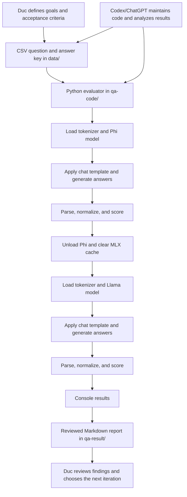

# First Architecture and QA Observation Note

**Project:** Local Small Language Model (SLM) evaluation and future fine-tuning  
**Observation date:** September 6, 2026  
**Status:** Baseline QA implementation; local API serving and fine-tuning have not yet been implemented

## Executive summary

This project compares two small language models running locally on an Apple Silicon Mac:

- Microsoft's Phi-4 Mini Instruct
- Meta's Llama 3.2 3B Instruct

The current system is a command-line test bench, not yet an API server or a training system. It downloads 4-bit MLX versions of both models, asks each model the same questions, grades their answers, and records the findings in Markdown reports. Loading one model at a time keeps memory use practical on a personal computer.

There are three main participants. Duc is the system owner and final decision-maker. The two local SLMs are the systems under test. The Codex/ChatGPT assistant helps design questions, inspect and modify the Python code, execute tests, analyze failures, document results, and manage the repository. The assistant is an engineering and analysis tool; it is not one of the models being benchmarked and should not silently decide whether an SLM answer is correct.

QA currently covers 21 subjects, with 10 questions in each subject. That is 210 questions per model and 420 model-answer evaluations in total. Based on the saved reports, both models scored 180 out of 210, or 85.7%. The matching totals do not mean that the models behave identically. Phi and Llama succeed and fail on different subjects, and some failures are caused by answer-format compliance rather than missing knowledge.

The test process is deliberately simple:

1. A CSV file supplies questions and expected answers.
2. A Python evaluator loads one model and its tokenizer.
3. The evaluator formats each question with that model's chat template.
4. The model generates an answer with temperature set to zero.
5. The evaluator extracts and normalizes the answer according to the test type.
6. It compares the extracted answer with the approved answer key.
7. The model is unloaded, memory is cleared, and the second model is tested.
8. Console output and observations are captured in a Markdown result report.

This baseline is useful, but it is not yet a rigorous model-certification system. Each subject has only ten questions; the reports are manually captured; exact-format grading can hide partial knowledge; and test questions may not represent real production usage. Before fine-tuning on Duc's writing, the project should automate report creation, save raw responses and run metadata, separate knowledge accuracy from instruction-following accuracy, and reserve a blind test set that is never used for training.

## Technical architecture

### 1. Purpose and current boundary

The intended end state is a local SLM service that can be trained or fine-tuned to write email and post responses in Duc's style, exposed through an API and operated without a graphical user interface.

The repository currently implements the baseline inference and QA layer:

- Local model download instructions and pinned Python dependencies
- Local MLX inference for both models
- CSV-based test datasets
- Three task-specific evaluators
- Human-readable Markdown QA reports
- Git history and release tags for reproducible project milestones

The following planned capabilities do **not** exist yet:

- A continuously running model server
- HTTP or OpenAI-compatible API endpoints
- A router or load balancer between the two models
- Fine-tuning, LoRA, or adapter training code
- Duc-writing data preparation, privacy review, or train/validation/test splitting
- Automated generation of the Markdown reports
- A production monitoring, authentication, rate-limit, or audit subsystem

Calling the current implementation a server would therefore be inaccurate. It is a local, sequential command-line inference and evaluation harness.

### 2. People, models, and responsibilities

| Participant | Role | Responsibilities | Important boundary |
|---|---|---|---|
| Duc | Owner, architect, and acceptance authority | Defines the desired writing style, approves datasets and answer keys, decides whether quality is satisfactory, and authorizes releases | Human judgment remains authoritative for style, correctness, privacy, and release decisions |
| Codex/ChatGPT assistant | Engineering and QA collaborator | Reads and edits repository files, runs shell commands and tests, researches documentation, analyzes model output, prepares reports, and performs requested Git operations | It can make mistakes; its analysis must be reviewable and it is not part of the local inference runtime |
| Phi-4 Mini Instruct | Local SLM under test | Generates text answers from prompts | Static model weights; no learning occurs during QA inference |
| Llama 3.2 3B Instruct | Local SLM under test | Generates text answers from prompts | Static model weights; no learning occurs during QA inference |

### 3. Data and execution flow



The two SLMs are evaluated in sequence, not concurrently. This design reduces peak unified-memory demand and makes it possible to run both models on a modest Apple Silicon computer. The test programs explicitly delete model objects, invoke Python garbage collection, and clear the MLX cache between models.

### 4. Repository layout

| Path | Function |
|---|---|
| `README.md` | Setup, model download, runtime, and QA usage instructions |
| `requirements.txt` | Pinned runtime dependencies: `mlx-lm==0.29.1` and `huggingface-hub==0.36.2` |
| `models/` | Local 4-bit MLX model files; intentionally not stored in Git |
| `data/` | CSV question sets and accepted answers |
| `qa-code/ask_models.py` | General command-line prompt runner for both models |
| `qa-code/test_models.py` | True/false evaluator |
| `qa-code/test_algebra_solving.py` | Exact rational-number evaluator for algebra solutions |
| `qa-code/test_fill_blank.py` | Normalized short-answer and classification evaluator |
| `qa-result/` | Saved result tables, summaries, and failure investigations |
| `architecture/` | Architecture decisions and observation notes, including this document |

### 5. Runtime environment

The implementation uses Python, MLX, and `mlx-lm`, with model snapshots downloaded from Hugging Face. It targets Apple Silicon and Metal acceleration. The README recommends at least 16 GB of unified memory and approximately 4 GB of disk capacity for model files. The local model directories occupy approximately 2.0 GB for Phi and 1.7 GB for Llama. Observed peak memory documented by this project is approximately 2.2 GB for Phi and 1.9 GB for Llama, although actual use can vary with prompt length, generated length, dependency versions, and operating-system behavior.

The downloaded checkpoints are community-produced MLX conversions of the publishers' instruction-tuned models:

- `mlx-community/Phi-4-mini-instruct-4bit`
- `mlx-community/Llama-3.2-3B-Instruct-4bit`

This distinction matters. The project evaluates these exact 4-bit conversions and this exact prompting code, not every possible deployment of the publishers' original models.

### 6. Capacity of Microsoft Phi-4 Mini Instruct

| Property | Project configuration or published description |
|---|---|
| Base model | `microsoft/Phi-4-mini-instruct` |
| Local checkpoint | `mlx-community/Phi-4-mini-instruct-4bit` |
| Model size | Approximately 3.8 billion parameters |
| Architecture | Dense, decoder-only transformer; local config identifies `phi3` |
| Local layers and width | 32 hidden layers; hidden size 3,072 |
| Attention configuration | 24 attention heads and 8 key/value heads |
| Local context setting | 131,072 positions, commonly described as a 128K-token context window |
| Local quantization | 4-bit weights, group size 64 |
| Local storage | Approximately 2.0 GB |
| Observed project peak memory | Approximately 2.2 GB |
| Intended strengths | Compact instruction following; reasoning, mathematics, logic, and common coding tasks |
| Important limitations | Less factual capacity than much larger models; sensitive to prompting and exact output protocols; static knowledge; generated answers may be wrong or fabricated |

Phi's official model card describes the original model as a 3.8B-parameter, 128K-context model trained with a mixture emphasizing synthetic data and filtered public data. The card emphasizes reasoning and notes the factual-capacity limits inherent in a small model. The project's 4-bit quantization reduces storage and runtime memory, but quantization can also alter output quality compared with the original-precision checkpoint.

The local QA results show that Phi can be very strong on concise factual and numerical prompts, but its failures often involve specialized terminology or failure to put the final answer in the requested machine-readable form. For example, the advanced-programming and gardening reports distinguish protocol failures from likely knowledge failures. This is why one total score should not be treated as a complete description of capability.

### 7. Capacity of Meta Llama 3.2 3B Instruct

| Property | Project configuration or published description |
|---|---|
| Base model | `meta-llama/Llama-3.2-3B-Instruct` |
| Local checkpoint | `mlx-community/Llama-3.2-3B-Instruct-4bit` |
| Model size | Approximately 3.21 billion parameters |
| Architecture | Autoregressive transformer; local config identifies `llama` |
| Local layers and width | 28 hidden layers; hidden size 3,072 |
| Attention configuration | 24 attention heads and 8 key/value heads, using grouped-query attention |
| Local context setting | 131,072 positions, commonly described as a 128K-token context window |
| Local quantization | 4-bit weights, group size 64 |
| Local storage | Approximately 1.7 GB |
| Observed project peak memory | Approximately 1.9 GB |
| Intended strengths | Multilingual dialogue, summarization, retrieval-oriented tasks, rewriting, and general assistant behavior |
| Officially supported languages | English, German, French, Italian, Portuguese, Hindi, Spanish, and Thai |
| Important limitations | Small-model factual and reasoning limits; prompt and formatting sensitivity; static knowledge cutoff; generated answers may be wrong or fabricated |

Meta describes the original 3B instruction model as a 3.21B-parameter text model tuned using supervised fine-tuning and reinforcement learning with human feedback. Its published knowledge cutoff is December 2023. As with Phi, this project runs a community 4-bit MLX conversion, so results apply to the local artifact and harness rather than every Llama 3.2 deployment.

The earlier algebra investigation is especially important: an answer pattern such as repeatedly returning `False` can be a prompt, label, parsing, or behavioral-bias problem rather than proof that the model knows none of the subject matter. QA must inspect raw output and failure patterns, not just the final percentage.

### 8. Capacity and role of the Codex/ChatGPT system

In this note, **Codex/ChatGPT assistant** means the OpenAI coding agent assisting in this repository. The user referred to it as “AI ChatGPT 5.6.” Public OpenAI material identifies GPT-5.6 as the frontier model powering ChatGPT's advanced work experience. The repository itself does not call an OpenAI model and does not programmatically verify the exact hosted model variant used by a particular assistant session. Consequently, this document does not claim an unpublished parameter count, context limit, training cutoff, or benchmark score for the assistant.

The name **ChatGPT-3** should not be used as a technical model identifier for this assistant. ChatGPT is the product and agent experience, while GPT names identify model families or versions. This project session identifies the collaborator as a Codex agent based on the GPT-5 family, and the project description refers to it as ChatGPT 5.6. Neither label means that GPT model weights are installed in this repository.

#### 8.1 Technical profile

The following table parallels the Phi and Llama profiles while distinguishing disclosed facts from unavailable implementation details:

| Property | Codex/ChatGPT assistant in this project |
|---|---|
| Provider | OpenAI |
| Product and agent environment | Codex operating within ChatGPT/Codex tooling |
| Model identity available to this project | GPT-5-family Codex agent; described in this project as ChatGPT 5.6. The repository does not query an API for a canonical deployment identifier. |
| Model size or parameter count | Not publicly disclosed for this hosted model and not inspectable from this repository |
| Neural-network architecture | OpenAI has not published a complete layer-by-layer architecture for this hosted model; it should not be assumed to match the open local transformer configurations |
| Local layers and hidden size | Not applicable. The model is hosted by OpenAI, and no GPT weights or layers are loaded on Duc's Mac. The number of hosted model layers and hidden dimensions is not disclosed here. |
| Attention heads and key/value heads | Not publicly specified for this deployment |
| Context setting | Managed by the hosted Codex/ChatGPT service. The exact usable context for this session is not exposed by the repository and must not be inferred from Phi or Llama's 131,072-position local settings. |
| Weight precision or quantization | Managed by OpenAI and not exposed to this project |
| Local model storage | None. Only repository files and the two local SLM checkpoints reside in this project. |
| Local model memory use | None for GPT inference. The Codex application and tools use local resources, but GPT model inference is not performed by MLX on this Mac. |
| Input capacity | Conversational instructions plus authorized repository files, command output, tool results, and selected web documentation supplied within the active task context |
| Output capacity | Natural-language analysis, source and documentation changes, structured data, test commands, and tool-assisted repository operations |
| Tool architecture | The hosted reasoning model works through a Codex agent layer that can inspect the workspace, patch files, execute approved commands, research sources, and interact with Git under permission controls |
| Persistence | Repository changes persist on disk; conversational working context is service-managed and is not a substitute for project documentation or version control |
| Network behavior | External access is tool-mediated and subject to sandbox, permission, and connector availability rather than unrestricted model access |
| Training relationship to this project | The assistant is not trained or fine-tuned by these QA runs, and the local QA data is not automatically incorporated into its model weights |
| Role in QA | Test designer, operator, analyst, and documentation assistant—not a benchmark contestant, answer-key authority, or automatic ground truth |

This hosted architecture differs fundamentally from the two local SLMs. Phi and Llama expose inspectable configuration files, run through MLX, and consume local unified memory during inference. The Codex/ChatGPT assistant is accessed as a managed agent service. Its practical capacity includes the surrounding tools and permission system, so a comparison based only on model parameter counts would be incomplete even if OpenAI published such a count.

#### 8.2 Speculative size estimate for comparison

OpenAI has not published the values below. They are **rough engineering estimates, not facts about GPT-5.6**, and should not be quoted as official specifications. They exist only to show the likely order-of-magnitude difference between a frontier hosted system and the 3.21B- and 3.8B-parameter local SLMs. The real implementation may fall outside these ranges or use a substantially different design.

| Property | Plausible range | Midpoint comparison assumption | Confidence |
|---|---:|---:|---|
| Architecture | Transformer-derived, likely sparse mixture-of-experts (MoE), possibly composed of multiple specialized models and routing systems | Sparse MoE transformer plus separate tool, safety, and routing services | Low |
| Total parameters across the primary model | 300 billion to 2 trillion | About 1 trillion | Very low |
| Parameters active for one generated token | 30 billion to 200 billion | About 100 billion | Very low |
| Transformer layers | 80 to 160 | About 120 | Very low |
| Hidden width | 8,192 to 24,576 | About 16,384 | Very low |
| Attention heads | 64 to 192 | About 128 | Very low |
| Key/value heads | 8 to 32 if grouped-query attention is used | About 16 | Very low |
| Usable context window | 200,000 to 1,000,000 tokens | About 400,000 tokens | Low; product limits can differ from model limits |
| Inference precision | Likely mixed low precision rather than full 32-bit weights | Roughly 8- or 16-bit-equivalent storage for active inference components | Very low |
| Approximate raw weight storage for a 1-trillion-parameter midpoint | Depends heavily on precision, sparsity, sharding, and auxiliary models | About 1 TB at 8 bits per parameter or 2 TB at 16 bits per parameter, before operational overhead | Mathematical illustration only |

The midpoint estimate would make the primary hosted model roughly **263 times larger than Phi's 3.8B parameters** and **312 times larger than Llama's 3.21B parameters** when comparing total parameters. If approximately 100B parameters were active for each token, the active computation would still involve roughly **26 times Phi's parameter count** or **31 times Llama's parameter count**. These ratios are illustrative calculations, not measured GPT-5.6 properties.

| Comparison | Phi-4 Mini | Llama 3.2 3B | Speculative hosted midpoint |
|---|---:|---:|---:|
| Total parameters | 3.8B | 3.21B | Approximately 1,000B |
| Active parameters per token | 3.8B, because it is dense | 3.21B, because it is dense | Approximately 100B if sparse MoE |
| Layers | 32 | 28 | Approximately 120 |
| Hidden width | 3,072 | 3,072 | Approximately 16,384 |
| Context capacity | 131,072 positions | 131,072 positions | Approximately 400,000 tokens |
| Where inference runs | Duc's Apple Silicon Mac | Duc's Apple Silicon Mac | OpenAI-managed accelerator infrastructure |

Parameter count is not a direct measure of answer quality. Training data, data quality, post-training, routing, inference-time reasoning, tool access, architecture, quantization, and task design can matter as much as—or more than—the raw number of weights. The Codex/ChatGPT **system** also includes tools, retrieval, safety controls, and orchestration that are absent from a bare local checkpoint. The fairest comparison is therefore both a model-size comparison and an end-to-end task-quality comparison.

#### 8.3 Agent capabilities

The useful distinction is between the language model and the agent environment:

| Capacity | What it provides in this project |
|---|---|
| Language and reasoning | Interprets requirements, proposes test designs, explains failures, and writes technical and plain-language documentation |
| Repository understanding | Searches and reads source, data, reports, configuration, and Git state |
| Controlled file editing | Creates and patches Python, CSV, Markdown, and configuration files inside the authorized workspace |
| Command execution | Runs model programs, tests, validators, and read-only diagnostic commands |
| Research | Consults current primary documentation when external facts require verification and links claims to sources |
| Git assistance | Stages, commits, tags, and pushes when Duc explicitly requests those actions |
| Safety controls | Operates within a filesystem sandbox and seeks approval for elevated access, network operations, or risky actions when required |
| Human collaboration | Reports assumptions and results to Duc, who remains the acceptance authority |

#### 8.4 Limitations and governance

Its limitations are equally important:

- It can misunderstand requirements, generate faulty code, or make incorrect factual judgments.
- It should not rewrite an answer key merely to make a model's score higher.
- It does not continuously run after the task ends unless a separately configured process or automation does so.
- It is not inside the local SLM inference path; loss of access to the assistant should not stop a finished local evaluator from running.
- It cannot infer private facts about Duc's writing style until suitable examples are supplied and approved for use.
- Its test-author role can introduce selection bias. For a defensible evaluation, a human should review the questions and a held-out set should be isolated from any fine-tuning workflow.

OpenAI describes Codex as an agent for writing, reviewing, and shipping code, capable of working across repositories, running commands, and reviewing changes. Those tool-enabled abilities come from the Codex environment around the model, not solely from text-generation weights.

### 9. How QA is conducted

#### 9.1 Test design

Each CSV contains a header row and ten questions. The answer key is stored beside each question. The datasets currently use three grading protocols:

| Protocol | Evaluator | Expected output | Grading method |
|---|---|---|---|
| True/false | `test_models.py` | `True` or `False` | Extract the first true/false word and compare it with the key |
| Algebra solving | `test_algebra_solving.py` | Final line such as `ANSWER: 7` | Parse the final numeric answer as an exact rational value and compare mathematically |
| Fill in the blank or classification | `test_fill_blank.py` | Final line such as `ANSWER: photosynthesis` | Normalize case, Unicode, punctuation, and whitespace, then compare with any pipe-separated accepted answer |

True/false is used for QA 1 through QA 4. Numeric algebra solving is used for QA 5. The generic fill-in-the-blank evaluator supports QA 6 through QA 21, including the `correct`/`incorrect` grammar classification test.

#### 9.2 Prompt construction

The evaluator does not concatenate arbitrary control tokens. It asks each tokenizer to apply that model's own chat template and adds a generation prompt. This gives Phi and Llama equivalent user instructions while respecting their different instruction formats.

The QA scripts set temperature to zero to reduce run-to-run variation. Output budgets are task-specific:

- True/false: 8 new tokens
- Fill in the blank: 64 new tokens
- Algebra solving: 256 new tokens, allowing brief reasoning before the final answer

The general `ask_models.py` demonstration is different: it uses the generation library's default sampling behavior and defaults to 64 new tokens. It is suitable for exploration, but not the reproducible scoring path.

#### 9.3 Validation and scoring

Before model inference, the scripts verify that the CSV exists, required columns are present, rows are non-empty, answers are valid for the selected protocol, and both local model directories exist. A malformed test stops with an error instead of silently producing a misleading score.

Every question is sent to both models under the same task instruction and generation limit. A recognized answer is marked correct only when it meets the evaluator's comparison rule. Missing required markers, extra incompatible content, or an unrecognized answer is counted as a failure. The script prints per-question details and a model summary to standard output.

The Markdown reports are presently a reviewed record of those runs. They are not produced directly by the evaluator code. This manual step makes room for useful qualitative investigation, but it also creates a transcription and reproducibility risk.

#### 9.4 Failure analysis

A low score is investigated at four levels:

1. **Knowledge error:** the model supplies the wrong concept or value.
2. **Reasoning error:** the model starts with relevant knowledge but reaches the wrong conclusion.
3. **Instruction or protocol error:** the answer may be present, but not in the exact form the parser requires.
4. **Harness or answer-key error:** the prompt, parser, accepted alternatives, token limit, or expected answer is defective.

The result reports preserve notable examples. The QA 18 and QA 20 reports, for instance, show why protocol accuracy and knowledge-aware review can differ. Such review should diagnose the mechanism without retroactively changing a valid rubric merely because a favored model performed poorly.

### 10. Baseline results observed in the repository

| QA | Subject | Phi | Llama |
|---:|---|---:|---:|
| 1 | True/false | 10/10 | 9/10 |
| 2 | Basic science | 10/10 | 9/10 |
| 3 | Basic math | 8/10 | 5/10 |
| 4 | High-school algebra, true/false | 7/10 | 5/10 |
| 5 | Algebra solving | 10/10 | 10/10 |
| 6 | World history | 9/10 | 10/10 |
| 7 | Health and medicine | 10/10 | 9/10 |
| 8 | Finance | 10/10 | 9/10 |
| 9 | Sports | 8/10 | 10/10 |
| 10 | Climate change | 10/10 | 8/10 |
| 11 | Entertainment | 8/10 | 7/10 |
| 12 | Literature | 7/10 | 10/10 |
| 13 | Animals | 10/10 | 10/10 |
| 14 | Plants | 9/10 | 10/10 |
| 15 | Chemistry | 8/10 | 10/10 |
| 16 | Computer science | 9/10 | 10/10 |
| 17 | Software engineering | 8/10 | 7/10 |
| 18 | Advanced programming | 5/10 | 7/10 |
| 19 | Biology | 9/10 | 9/10 |
| 20 | Gardening | 5/10 | 8/10 |
| 21 | Grammar | 10/10 | 8/10 |
| **Total** | **210 questions per model** | **180/210 (85.7%)** | **180/210 (85.7%)** |

These results describe one collection of small, manually selected tests. They are a regression baseline, not a statistically reliable proof that the models have equal general capability. The most useful information is often in the per-subject and per-error patterns rather than the aggregate.

### 11. Reproducibility and quality risks

The current QA design has several known constraints:

- Ten questions per subject is too small to estimate broad subject mastery reliably.
- The questions are curated rather than randomly sampled from a documented population.
- There is no uncertainty interval, repeated-run analysis, or independent human adjudication.
- Exact output parsing mixes task knowledge with instruction-following and format compliance.
- The quantized community checkpoints may behave differently from original-precision publisher checkpoints.
- Raw model responses and complete run metadata are not stored in a machine-readable artifact.
- Markdown report creation is manual.
- Dataset and model checksums are not included in reports.
- Questions created with AI assistance may resemble material present in model training data.
- Reusing QA questions during prompt tuning or fine-tuning would contaminate them as a final test set.
- Health and finance questions are educational QA only and must not be treated as professional advice validation.
- Long-context capacity is configured but not tested by these short questions.
- Throughput, latency, concurrent requests, safety, style similarity, and API reliability are not measured yet.

### 12. Recommended next architecture

Before using Duc's writing as training data, the project should evolve in this order:

1. **Automate evidence capture.** Make each evaluator write JSON plus Markdown containing timestamp, Git commit, model path and revision, dependency versions, generation settings, raw response, parsed answer, expected answer, and score.
2. **Separate metrics.** Report semantic correctness, exact protocol compliance, latency, token count, and failures independently.
3. **Strengthen datasets.** Expand each domain, have a human verify answer keys, document accepted alternatives, and add adversarial and ambiguous cases.
4. **Create protected splits.** Keep training, validation, and final blind-test data separate. Never train on the regression or blind-test questions.
5. **Establish the local API.** Add a stable service contract, health check, model selection, request limits, structured errors, logging, and authentication appropriate to the deployment boundary.
6. **Prepare Duc's writing corpus.** Remove secrets and third-party private data, deduplicate examples, preserve task context, and label desired versus undesired responses.
7. **Fine-tune incrementally.** Start with a reversible adapter such as LoRA, retain the untouched base checkpoints, and record every dataset and training configuration.
8. **Evaluate style and capability together.** Test whether the model sounds like Duc while also checking factual accuracy, instruction following, safety, and regression against the existing baseline.
9. **Use human acceptance tests.** Duc should blindly compare candidate responses and decide whether style changes are genuinely preferable.
10. **Promote only reproducible builds.** A released model should be tied to source commit, data version, adapter checksum, evaluation report, and rollback instructions.

### 13. Local commands used by the architecture

From the repository root after creating and activating the documented virtual environment:

```bash
# Ask both models the original demonstration question.
python qa-code/ask_models.py "What is the capital of France?"

# Run true/false QA.
python qa-code/test_models.py data/qa1-true-false.csv

# Run exact numeric algebra QA.
python qa-code/test_algebra_solving.py data/qa5-algebra-solving.csv

# Run short-answer or classification QA.
python qa-code/test_fill_blank.py data/qa21-grammar.csv
```

The remaining CSV files can be supplied to the evaluator matching their protocol. The command output should be reviewed against the corresponding file under `qa-result/`.

### 14. Source and evidence notes

This observation combines direct inspection of the repository with publisher documentation available on the observation date:

- [Project README](../README.md)
- [QA source code](../qa-code/)
- [QA datasets](../data/)
- [Saved QA reports](../qa-result/)
- [Microsoft Phi-4 Mini Instruct model card](https://huggingface.co/microsoft/Phi-4-mini-instruct)
- [Meta Llama 3.2 3B Instruct model card](https://huggingface.co/meta-llama/Llama-3.2-3B-Instruct)
- [OpenAI: ChatGPT for advanced work and GPT-5.6](https://openai.com/index/chatgpt-for-your-most-ambitious-work/)
- [OpenAI: Introducing the Codex app](https://openai.com/index/introducing-the-codex-app/)

Published model claims describe the original publisher checkpoints. Local sizes, configuration fields, memory observations, scripts, scores, and implementation status come from this repository and apply to the exact local setup described here.
