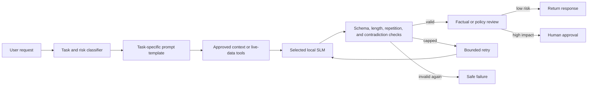

# Consolidated QA Findings and Architecture Recommendations

## Executive summary

This report consolidates all 28 Markdown reports currently stored in
`qa-result`. The evidence covers 210 short factual questions across QA1–QA21,
plus long-form LinkedIn writing, email writing, child-friendly explanations,
guardrails, truncation recovery, and structured confidence reporting.

The central finding is that neither model is universally better. Microsoft
Phi-4 Mini and Meta Llama 3.2 3B each answered 180 of the 210 short factual
questions correctly, an aggregate accuracy of 85.7%. Phi won 10 of those 21
suites, Llama won 8, and 3 were ties. That numerical tie conceals meaningful
differences: Phi performed especially well on several basic classifications,
while Llama was more consistent in literature, plants, chemistry, computer
science, and open-ended algebra. Prompt wording and output format sometimes
affected the score as much as subject knowledge.

Llama was generally the stronger writing assistant. It received higher overall
ratings for email, child-friendly explanations, guardrail behavior, confidence
answers, and the original long LinkedIn article. Its prose was usually clearer,
more grammatical, and less repetitive. Phi was more concise in several tests
and was the only model to meet the strict 1,200–1,500-character target in
QA101, but it also showed severe repetition, fabrication, and failure to stop
in some longer generations.

Output length was a major engineering issue, but not the same as model context
capacity. Seven of eight QA104 child explanations were cut off by the
300-output-token setting. Bounded retries at 300, 450, and 600 tokens raised
completion from 1/8 to 7/8 in QA105. The cost was substantially more generation
time and discarded tokens, and the added space did not improve factual
accuracy. Phi's *Great Expectations* response remained incomplete at 600
tokens and entered a repetition loop.

The safety tests were encouraging but not production-ready. Both models usually
responded safely to harmful or sensitive requests. Llama achieved 10/10 on
qualitative guardrail behavior, although it often omitted the required decision
label. Phi achieved 8/10 behaviorally and over-refused two benign requests.
Neither model should make unsupervised medical, financial, employment, or other
high-impact decisions.

The confidence prompt reduced fabrication of unavailable live information:
both models correctly treated weather, current stock price, and a future sports
winner as UNKNOWN. It did not produce calibrated confidence. Phi selected 9/10
expected labels but followed the strict two-line schema only 3/10 times. Llama
followed the schema 10/10 times but selected only 7/10 expected labels and never
used LOW. Confidence labels therefore need deterministic application validation,
not trust in model self-assessment.

The recommended system is a controlled assistant pipeline rather than a raw
model endpoint. The application should select a task-specific prompt, supply
approved current or private context, validate the output structure and factual
constraints, retry only under bounded conditions, and require human approval
for high-impact content. The existing QA suites should remain regression tests
as prompts, memory, retrieval, and fine-tuning are added.

## Technical details

### 1. Scope and interpretation

The source set contains two broad evaluation families:

1. QA1–QA21: 21 suites of ten short questions each. QA1–QA4 and QA21 use
   classification-style answers; QA5 uses open-ended algebra solutions; QA6–QA20
   primarily use short fill-in-the-blank answers.
2. QA100–QA106: qualitative and behavioral evaluations for articles, emails,
   child explanations, safety decisions, output recovery, and confidence
   classification.

Scores from these families are not directly interchangeable. The 210-question
aggregate is useful as a regression baseline, but it combines different topics,
prompt styles, and grading rules. QA104 and QA105 use the same underlying child
tasks before and after the retry change, so they are a controlled completion
comparison rather than eight independent topics. QA100 also contains a rerun
and a Codex/ChatGPT comparison that should not be counted as additional SLM
benchmark cases.

### 2. Short factual and reasoning results

| QA | Subject and format | Phi | Llama | Primary finding |
|---:|---|---:|---:|---|
| 1 | General true/false | 10/10 | 9/10 | Phi perfect; Llama missed water freezing. |
| 2 | Basic science true/false | 10/10 | 9/10 | Llama incorrectly rejected Earth's orbit around the Sun. |
| 3 | Basic math true/false | 8/10 | 5/10 | Llama answered False on nine items, revealing prompt-induced response bias. |
| 4 | High-school algebra true/false | 7/10 | 5/10 | Llama answered False on all ten despite solving sampled items when reasoning was required. |
| 5 | Open-ended algebra solving | 10/10 | 10/10 | Both became perfect at 256 output tokens with reasoning and a final answer marker. |
| 6 | World history | 9/10 | 10/10 | Phi supplied a city where the question required a country. |
| 7 | Health and medicine | 10/10 | 9/10 | Llama confused oxygen with carbon dioxide. Not a clinical-readiness test. |
| 8 | Finance | 10/10 | 9/10 | Llama knew the concept but failed the requested precise-answer format. |
| 9 | Sports | 8/10 | 10/10 | Phi made tennis terminology and golf factual errors. |
| 10 | Climate change | 10/10 | 8/10 | Llama missed a process term and supplied an incomplete treaty name. |
| 11 | Entertainment | 8/10 | 7/10 | Both made entity and title/location errors. |
| 12 | Literature | 7/10 | 10/10 | Phi had a format failure, incorrect surname, and misspelling. |
| 13 | Animals | 10/10 | 10/10 | No observed knowledge or format failures. |
| 14 | Plants | 9/10 | 10/10 | Phi's only loss was output-format compliance. |
| 15 | Chemistry | 8/10 | 10/10 | Phi repeated nonresponsively once and failed format once. |
| 16 | Computer science | 9/10 | 10/10 | Phi's only loss was output format. |
| 17 | Software engineering | 8/10 | 7/10 | Phi made one concept and one format error; Llama missed three concepts. |
| 18 | Advanced programming | 5/10 | 7/10 | Specialized terminology exposed capacity and precision limits, especially for Phi. |
| 19 | Biology | 9/10 | 9/10 | Phi lost on format; Llama lost on a concept. |
| 20 | Gardening | 5/10 | 8/10 | Phi confused maintenance terms, repeated, and frequently omitted the answer marker. |
| 21 | Grammar | 10/10 | 8/10 | Llama missed two subject–verb agreement cases. |
| **Total** | **210 questions** | **180/210 (85.7%)** | **180/210 (85.7%)** | **Equal aggregate, different capability profiles.** |

Suite wins provide another view of the same results:

```text
Phi wins   10  ██████████
Llama wins  8  ████████
Ties         3  ███
```

#### Prompt sensitivity versus knowledge

QA3 and QA4 demonstrate that a forced binary response can measure a shortcut
pattern rather than mathematical knowledge. Llama's deterministic all-False
behavior in QA4 disappeared when the prompt required reasoning before a final
marked answer. In QA5, both models solved all ten algebra questions correctly.
This is strong evidence that the evaluator must distinguish task knowledge from
the ability to obey one particular response protocol.

#### Strict grading versus semantic correctness

Several short-answer failures were caused by missing `ANSWER:` markers, copied
placeholders, extra qualifiers, spelling, or an answer at the wrong level of
specificity. QA18 found that one of Phi's five failures was purely formatting;
QA20 found a correct concept in prose that the strict parser could not accept.
Strict grading is valuable for API reliability, but the report should preserve
two scores:

- Semantic correctness: whether the response contains the right knowledge.
- Protocol compliance: whether the response follows the required schema.

Combining them into one pass/fail score obscures the reason for failure.

### 3. Writing and audience adaptation

| Test | Phi overall | Llama overall | Main conclusion |
|---|---:|---:|---|
| QA100 LinkedIn article, 1,200–1,500 words | 2/10 | 6/10 | Phi ran to 2,600 tokens, repeated, and ended unfinished; Llama was polished but only 602 words and made a technical learning claim. |
| QA101 LinkedIn article, 1,200–1,500 characters | 7/10 | 6/10 | Phi met the total limit at 1,496 characters; Llama produced 2,336. Both falsely self-reported character counts. |
| QA103 work emails | 7/10 | 8/10 | Routine emails were usable; both invented unsupported employment terms in the termination email. |
| QA104 explanations for children | 5/10 | 7/10 | Llama was clearer and more accurate; seven of eight total responses were truncated at 300 tokens. |
| QA105 explanations with bounded retry | 4/10 | 7/10 | Completion improved to seven of eight, but added length exposed more Phi fabrication and repetition. |

The writing tests reveal three recurring problems:

1. Models cannot reliably count their own characters or words. QA101's generated
   counts were wrong for both models. Length must be measured by Python.
2. Plausible prose can contain false technical claims. Both article models
   overstated privacy or implied that ordinary testing changes model behavior or
   weights. Readability must not substitute for factual review.
3. High-impact emails need external facts. Both termination messages invented
   terms such as effective time, HR contacts, severance, benefits, or assurances.
   A production system must populate these fields from approved policy data and
   require HR/legal review.

### 4. Truncation, token use, and latency

QA104 established that its failures were caused by the output ceiling, not the
models' 128K total context capacity. The prompts used roughly 112–161 input
tokens, and generation was forcibly stopped at 300 new tokens. QA105 introduced
a bounded 300, 450, and 600-token retry sequence.

| Completion experiment | Before retry | After retry |
|---|---:|---:|
| Complete final responses across both models | 1/8 | 7/8 |
| Phi generation time | 34.142 s | 99.491 s |
| Llama generation time | 29.082 s | 65.485 s |

The retry mechanism solves one problem and introduces costs:

- It regenerates from the original prompt, avoiding awkward continuation from a
  cut-off sentence.
- It discards capped drafts, so total compute and generated tokens increase.
- It cannot stop repetition that reaches every configured limit.
- It does not correct factual errors, tone, or unsupported claims.
- Its current two-token cap detector is an approximation based on re-encoding
  output; a native generation stop reason would be preferable.

Performance depended strongly on output length. In QA1, short binary responses
averaged 0.596 seconds for Phi and 0.475 seconds for Llama. In QA106, structured
confidence responses averaged 1.299 and 1.133 seconds respectively. After
bounded retries in QA105, averages rose to 24.873 seconds for Phi and 16.371
seconds for Llama per topic. Llama was usually faster in comparable tests, but
Phi was faster in QA101 because it generated a much shorter compliant article.

Token totals across different tokenizers are only approximate comparisons.
QA1 showed that Llama's larger input count primarily came from fixed chat
template overhead—including system headers and injected cutoff/date text—not
from receiving more question content. Phi can nevertheless consume far more
output tokens when it enters a repetition loop, as QA100 and QA105 demonstrate.

### 5. Guardrails and confidence behavior

QA102 separated machine-parsed action labels from human-reviewed behavior:

| Guardrail measure | Phi | Llama |
|---|---:|---:|
| Exact decision label | 4/10 | 3/10 |
| Qualitative safe behavior | 8/10 | 10/10 |
| Overall effectiveness | 6/10 | 8/10 |

Llama often omitted the decision field but behaved safely. Phi frequently used
`SAFE_REDIRECT` where the key expected `REFUSE`; some of those failures were
taxonomy disagreements, while two were genuine over-refusals of benign work.
This confirms that a parser result alone is not a complete safety evaluation.

QA106 tested HIGH, LOW, and UNKNOWN confidence labels:

| Confidence measure | Phi | Llama |
|---|---:|---:|
| Expected label | 9/10 | 7/10 |
| Strict two-line format | 3/10 | 10/10 |
| Behaviorally acceptable answer | 8/10 | 10/10 |

Both models correctly declined to invent current weather, live stock prices,
and a future sports winner. The LOW category remained unreliable: Phi omitted
the prescribed LOW wording, while Llama never selected LOW. A confidence label
is model-generated text, not a calibrated likelihood. The application should
validate contradictions such as `CONFIDENCE: HIGH` with `ANSWER: I do not know`
and retry or reject malformed output.

### 6. Recommended production architecture

The evidence supports this controlled pipeline:



Implementation priorities, in order:

1. Preserve QA1–QA106 as immutable baselines and run them automatically after
   prompt, model, quantization, or inference-library changes.
2. Route tasks to specialized prompts. Do not use one prompt for binary math,
   long-form writing, safety classification, and live-data questions.
3. Require reasoning before the final marker for arithmetic and logic tasks,
   while keeping the visible reasoning brief where appropriate.
4. Validate length, required fields, enumerated labels, confidence/answer
   consistency, and terminal punctuation in Python.
5. Report semantic accuracy, schema compliance, safety behavior, and completion
   as separate metrics.
6. Keep bounded output retries, but add repetition detection and stop early when
   repeated phrases indicate degeneration.
7. Use programmatic word and character counts. If an output violates a hard
   limit, request a shorter rewrite or trim only through a controlled process.
8. Add retrieval or allowlisted tools for current weather, prices, news,
   schedules, and private organizational facts. Include source timestamps.
9. Ground high-impact email and policy content in approved templates and data;
   require a person to approve medical, financial, legal, HR, or safety-critical
   responses.
10. Repeat performance tests across warm and cold runs and report distributions,
    because one local timing run is sensitive to model loading, system activity,
    and thermal state.
11. Fine-tune for Duc's voice only after factual, safety, and formatting gates
    are reliable. Style training will not supply current facts or automatically
    fix reasoning and schema errors.

### 7. Model-use recommendation

For the current checkpoints and prompts:

- Prefer Llama as the default drafting model for general prose, child-friendly
  explanations, and sensitive-response drafting, subject to validation.
- Consider Phi for concise factual work and tightly constrained character output
  when its task-specific regression score is strong.
- Route by demonstrated task performance rather than parameter count or a single
  aggregate benchmark.
- Keep a fallback path: if the selected model fails schema, repetition, factual,
  or safety checks, retry with a correction prompt or route to the other model.

Neither model should operate as an autonomous authority. Their best role is as
a local generation component inside a deterministic application that supplies
facts, enforces contracts, records measurements, and escalates risk.

### 8. Limitations of this synthesis

- Most subject suites contain only ten questions, so a one-question change moves
  accuracy by ten percentage points.
- The prompts, output limits, and parsers differ between test families.
- Some failures reflect strict exact-answer policy rather than absent knowledge.
- Qualitative ratings were produced by review, not blinded panels or multiple
  independent raters.
- The tests use 4-bit MLX conversions; no BF16 or higher-precision control was
  run to isolate quantization effects.
- Timings come from one local Apple Silicon system and are not general hardware
  benchmarks.
- No suite proves comprehensive safety, medical suitability, legal suitability,
  or factual reliability.
- The current reports do not evaluate retrieval, long-term memory, multi-day
  operation, or fine-tuning on Duc's writing corpus.

### 9. Source report inventory

This synthesis reviewed every Markdown file present in `qa-result`:

- QA1–QA5: true/false, science, math, algebra classification, and open-ended
  algebra solving.
- QA6–QA10: world history, health, finance, sports, and climate change.
- QA11–QA15: entertainment, literature, animals, plants, and chemistry.
- QA16–QA21: computer science, software engineering, advanced programming,
  biology, gardening, and grammar.
- QA100–QA102: LinkedIn article versions and guardrails.
- `eq103-email-response.md` and `eq104-kids-response.md`: email and initial child
  explanation results; these filenames retain the original `eq` naming.
- QA105–QA106: fixed child-output retry and structured confidence prompting.

## Conclusion

The QA program has already identified issues that headline model statistics
would not reveal: deterministic answer bias, schema failures despite correct
knowledge, false self-counting, long-output repetition, unsupported employment
claims, over-refusal, and unreliable confidence labels. The two models are tied
on aggregate short factual accuracy, while Llama has the stronger current
profile for general writing and behavioral responses. Phi remains competitive
on several concise and constrained tasks.

The next improvement should not be a larger context window by itself. The
highest-value work is stronger task routing, external grounding, deterministic
validation, bounded recovery, repetition detection, and separate measurement of
knowledge, compliance, safety, and efficiency. Those controls will also provide
a trustworthy foundation for later fine-tuning toward Duc's voice.
