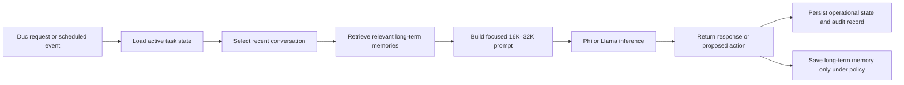

# Token, Context Window, and Memory Design Note

**Project:** Local Small Language Model (SLM) assistant  
**Date:** September 6, 2026  
**Models:** Microsoft Phi-4 Mini Instruct and Meta Llama 3.2 3B Instruct

## Executive summary

### Tokens and response time

A token is a small piece of text. It can be a word, part of a word, punctuation,
or a model-control marker. The two SLMs do not always count the same text as the
same number of tokens because each has its own tokenizer and chat format.

In the timed rerun of the first QA test, Phi averaged 0.596 seconds per answer
and Llama averaged 0.475 seconds. Across both models, one question-model
response averaged 0.535 seconds. These values describe one short local run, not
a permanent performance guarantee.

Phi used an average of 36.7 counted input-and-output tokens per question. Llama
used 68.4. The questions themselves tokenized almost identically. Llama's
higher count came mainly from its chat template, which automatically added a
system section, knowledge-cutoff and date text, and longer message markers.
Llama nevertheless answered faster in this run.

### Context window

The context window is the model's temporary working area. It contains the
system instructions, conversation history, current request, retrieved
information, and generated answer. Input and output therefore share the
available context budget.

Both local model configurations support up to 131,072 positions, commonly
called a 128K-token context window. This is a maximum capacity, not the amount
used for every question. The short QA questions use only a tiny portion of it.
Increasing the maximum window does not make the model inherently more
accurate. More context helps only when it supplies relevant information;
irrelevant or conflicting material can reduce quality while increasing memory
use and response time.

For a continuously operating Duc assistant, the recommendation is to retain
128K as the available maximum but normally build focused prompts of about
16K–32K tokens. The system should expand beyond that only when a task genuinely
requires long documents or extensive history.

### Contextual memory

Contextual memory is information deliberately included in the current prompt,
such as recent messages, the active task, and a summary of earlier discussion.
It is temporary. The model does not permanently learn it, and it disappears
when it is no longer supplied in a later prompt.

The QA tests are intentionally stateless. Each question is formatted as a new
prompt, so one question's text and answer do not become memory for the next
question. Keeping the model loaded in memory does not create conversational
memory.

For the Duc assistant, contextual memory should contain recent messages, a
compact rolling summary, current task state, and only the long-term memories
relevant to the present request. Sending the entire history every time would
waste tokens and could distract the model.

### Long-term memory

Neither local SLM currently has long-term memory. Its trained weights contain
static learned patterns, but previous user queries do not modify those weights.
True long-term memory must be implemented outside the model with persistent
storage.

The recommended starting point is SQLite with full-text search. It should store
approved preferences, writing examples, people, projects, decisions,
commitments, and task state. A vector index can be added later for semantic
retrieval. Duc must be able to inspect, correct, export, expire, and delete
stored memories.

Fine-tuning and long-term memory serve different purposes. Fine-tuning should
teach stable writing behavior and style. Long-term memory should store facts
and preferences that can change. Contextual memory should hold the small amount
of information needed for the current interaction.

## Technical details

### 1. Terminology

| Term | Meaning in this project |
|---|---|
| Token | A tokenizer-specific unit of text or a model-control marker |
| Input tokens | Tokens in the complete rendered prompt, including instructions and chat-template markers |
| Output tokens | Tokens generated as the model's response |
| Context window | Maximum working sequence containing input and generated output |
| Output limit | Maximum number of new tokens the evaluator permits the model to generate |
| Contextual memory | Recent or retrieved information inserted into the current prompt |
| Long-term memory | Persistent information saved outside the model and retrieved in later sessions |
| Trained knowledge | Patterns encoded in model weights during training or fine-tuning |
| Task state | Persistent operational facts such as current status, completed steps, pending actions, and errors |

Tokens are not directly comparable across tokenizers. A count of 50 Phi tokens
and 50 Llama tokens can represent different text. Token count is useful for
measuring the workload of one model and for identifying template overhead, but
it is not itself a quality score.

### 2. Measured QA1 response time

The evaluator measured wall-clock time with Python's `time.perf_counter()`
around each `generate()` call. Model loading and cleanup were measured
separately. The suite contained ten true-or-false questions and used
temperature 0.0 with an eight-new-token output ceiling.

| Model | Accuracy | Load | Responses total | Average | Median | P95 | Fastest | Slowest | Cleanup | End-to-end |
|---|---:|---:|---:|---:|---:|---:|---:|---:|---:|---:|
| Phi-4 Mini | 10/10 | 1.349 s | 5.959 s | 0.596 s | 0.631 s | 0.733 s | 0.430 s | 0.736 s | 0.048 s | 7.367 s |
| Llama 3.2 3B | 9/10 | 1.033 s | 4.746 s | 0.475 s | 0.446 s | 0.558 s | 0.425 s | 0.587 s | 0.027 s | 5.821 s |

The 20 responses took 10.705 seconds and averaged 0.535 seconds each. The two
sequential model runs took 13.188 seconds end to end, excluding Python process
startup before the first internal timer.

These figures should be treated as an observation, not a stable benchmark.
Latency changes with prompt and output length, hardware load, thermal state,
model warm-up, MLX version, caching, and background processes. A production
benchmark should include repeated cold and warm runs and report at least the
median and p95.

### 3. Measured token use

The evaluator approximated token use by encoding the rendered chat prompt and
decoded response with the tokenizer belonging to the tested model. Decoding
can remove an internal end-of-sequence marker, so the output measurement may
differ slightly from the exact internal generated-token count.

| Model | Input tokens | Output tokens | Combined tokens | Average per question |
|---|---:|---:|---:|---:|
| Phi-4 Mini | 313 | 54 | 367 | 36.7 |
| Llama 3.2 3B | 655 | 29 | 684 | 68.4 |
| **Combined** | **968** | **83** | **1,051** | **52.6 per model response** |

For the first QA question, the shared instruction and statement required 26
Phi tokens and 27 Llama tokens. The fully rendered prompt required
approximately 29 Phi tokens and 63 Llama tokens. Across all questions, Llama
used 34 or 35 additional input tokens per question.

The Llama template automatically inserted:

- A beginning-of-text marker
- A system-role header even though the caller supplied no system message
- Its December 2023 knowledge-cutoff line
- A current-date line
- System, user, and assistant message delimiters
- End-of-turn markers

The injected date and knowledge-cutoff text accounted for approximately 20
tokens in the examined prompt. Llama's more elaborate message structure made
up most of the remaining difference. Phi's template used compact user, end,
and assistant markers.

Phi reached the eight-token output ceiling on six questions because it
continued beyond the requested label. The grader still extracted its initial
`True` or `False`. Llama generated fewer output tokens, so the overall token
difference was driven by Llama's input template rather than response verbosity.

### 4. Options for reducing token use

The baseline should remain unchanged for historical comparison. Optimizations
should be tested in a separate run:

1. Use a minimal Llama template that retains its expected beginning-of-text,
   user, assistant, and end-of-turn markers but removes the empty system block
   and date metadata. A tokenization experiment reduced the first prompt from
   approximately 62 to 37 tokens.
2. Shorten the instruction to wording such as `True or False only:`. Combined
   with the minimal template, the example prompt fell to approximately 22
   tokens. Accuracy and format compliance must be retested.
3. Reduce the true-or-false output ceiling from eight tokens to two, or stop
   generation after a complete valid label. The savings are expected to be
   larger for Phi than Llama based on the measured responses.
4. Batch questions to pay fixed instruction overhead once, if the application
   can tolerate cross-question influence and more complicated parsing.
5. Use prefix or key/value-cache reuse in the future server. Caching reduces
   repeated computation and latency, although it may not change the logical
   token count reported for a request.

Changing only Llama's prompt would make a shared-prompt comparison less
controlled. The project should retain the existing baseline and separately
compare model-specific optimized prompts.

### 5. Context-window behavior

For a model with a 128K context capacity, the governing relationship is:

```text
system instructions
+ conversation history
+ current request
+ retrieved documents and memories
+ generated response
<= context-window capacity
```

The QA scripts' `max_tokens` values are output ceilings, not context-window
sizes:

| Evaluator | Maximum new output tokens |
|---|---:|
| True/false | 8 |
| Fill in the blank | 64 |
| Algebra solving | 256 |
| General `ask_models.py` default | 64 |

If a prompt consumes most of the context window, less capacity remains for the
answer. The application must reserve output space before sending the request.
When information does not fit, it should prioritize, summarize, retrieve
smaller relevant sections, or split the task rather than silently discard
important instructions.

A larger context window can help when the answer depends on a long document,
earlier conversation, several source files, or examples of Duc's writing. It
does not change the knowledge stored in the weights. Excessive irrelevant,
duplicated, or contradictory context can make important facts harder to find
and can increase latency and unified-memory consumption.

### 6. Recommended working-context budget

Both local configurations expose 131,072 positions. The assistant service
should keep that maximum available while using a smaller prompt for normal
work:

| Prompt component | Suggested normal budget |
|---|---:|
| System and safety instructions | 1K–2K tokens |
| Duc's stable style profile | 1K–3K tokens |
| Recent conversation | 4K–8K tokens |
| Current task state | 2K–6K tokens |
| Retrieved long-term memories | 2K–8K tokens |
| Relevant documents or email | 4K–12K tokens |
| Reserved generated response | 2K–4K tokens |
| **Typical assembled context** | **16K–32K tokens** |

This is a flexible budget rather than a requirement to fill every category.
The prompt builder should include the minimum relevant information and expand
toward 64K or 128K only for tasks that need it.

### 7. Contextual-memory design

The current QA architecture makes a fresh prompt for each question. Previous
questions and answers are not appended, and the models' weights do not change.
Model residency and MLX caches improve operation but do not create memory of
earlier queries.

The continuous assistant should assemble contextual memory for every turn from:

1. The most recent messages, retained verbatim up to a configured token budget
2. A rolling 1K–2K-token summary of older relevant discussion
3. Structured current-task state
4. Long-term memories retrieved because they match the current request
5. Documents or writing examples specifically needed for the task

A suitable starting policy is to retain the latest 10–30 messages subject to an
approximately 8K-token ceiling. Summarization must preserve decisions,
commitments, unresolved questions, names, dates, and constraints. Structured
task state should remain authoritative when a conversational summary and the
database disagree.

### 8. Long-term-memory design

Use an external persistent store rather than expecting the context window or
model weights to remember previous sessions. SQLite with full-text search is a
practical initial implementation for a single-user local assistant.

Suggested memory categories include:

- Approved writing-style preferences and representative examples
- People, organizations, and relationships relevant to Duc's work
- Projects, objectives, decisions, and commitments
- Reusable corrections explicitly supplied by Duc
- Unfinished work and follow-up requirements
- Source references and confidence information

Each stored memory should include structured governance metadata:

```text
memory_id
category
content
source
created_at
updated_at
last_used_at
confidence
importance
expiration_date
privacy_level
user_approved
```

Add semantic vector retrieval only when full-text search proves insufficient.
Retrieval should rank memories by relevance, importance, freshness, and
confidence, then fit the best items within the allocated prompt budget.

### 9. Memory safety and user control

The system should not save every conversation automatically. Permanent memory
should be limited to information that Duc approves, is useful across sessions,
and is appropriate to retain. Passwords, access tokens, unnecessary third-party
personal information, unsupported model guesses, and transient conversation
should not become long-term memory.

Duc should be able to:

- Inspect why a memory was retrieved
- View and search all stored memories
- Correct inaccurate memories
- Delete individual memories
- Assign or change expiration dates
- Disable memory for a conversation
- Export or erase the memory store

Memory retrieval must be treated as evidence, not guaranteed truth. The system
should preserve the source and confidence of a claim and allow current user
instructions to correct stale information.

### 10. Continuous-operation architecture

Operational state must be stored separately from conversational memory. A
service that runs over many days should persist:

- Active tasks and current status
- Completed and pending actions
- Last successful run and heartbeat
- Failures, retry counts, and recovery instructions
- Scheduled work
- Model, prompt, and application versions
- Actions awaiting user approval
- An auditable history of material operations

After a restart, the service should reconstruct its state from persistent
storage. It should not rely on an old model context or in-memory Python objects
surviving.



### 11. Relationship between fine-tuning and memory

| Mechanism | Best use | Update frequency | User-editable |
|---|---|---|---|
| Fine-tuning or LoRA | Stable writing style, tone, and recurring response behavior | Infrequent, controlled training releases | Indirectly, through dataset and retraining |
| Long-term memory | Changeable facts, preferences, relationships, decisions, and commitments | As approved information changes | Yes |
| Contextual memory | Recent conversation and information relevant to the immediate task | Every request | Indirectly, through conversation and retrieval controls |
| Operational state | Reliable continuation of tasks and service recovery | After every material state change | Yes, through task-management controls |

Fine-tuning should not be used to memorize frequently changing personal facts.
Likewise, adding writing examples to a prompt is useful for experimentation but
is not permanent learning. The final Duc assistant will need all four
mechanisms, with clear ownership and evaluation boundaries.

### 12. QA recommendations

Keep the existing factual QA suites stateless so their results remain
comparable. Add separate evaluations for memory and performance:

- Recall an approved fact after a service restart
- Correct an old memory and verify that the correction replaces it
- Expire or delete a memory and verify that it is no longer retrieved
- Keep facts from different people or projects isolated
- Ignore irrelevant memories when answering an unrelated request
- Measure retrieval accuracy and whether cited memory supports the response
- Measure latency and token use at 8K, 16K, 32K, 64K, and near-128K contexts
- Test whether longer context improves accuracy or merely adds distraction
- Compare cold starts, warm requests, and repeated cached-prefix requests
- Confirm that QA datasets are never written into long-term memory

The primary acceptance criterion is not maximum context use. It is whether the
assistant retrieves the right information, produces a correct and Duc-like
response, respects privacy and user control, and continues reliably across
days and restarts.

## Related project evidence

- [First architecture and QA observation](first-observation-note.md)
- [QA1 measurements and token investigation](../qa-result/qa1-true-false-result.md)
- [True/false evaluator](../qa-code/test_models.py)
- [Project setup and model information](../README.md)
